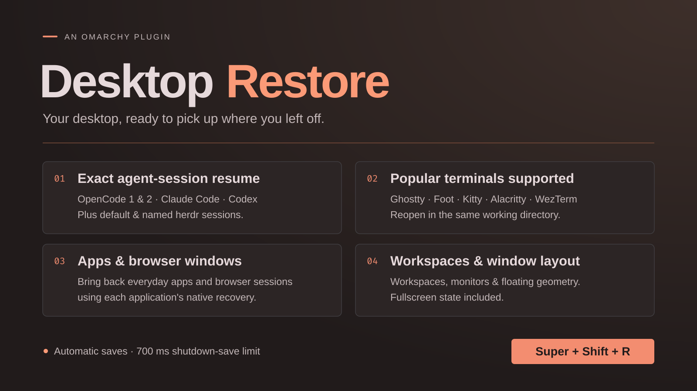

# Desktop Restore

Save your Omarchy desktop automatically and restore it after reboot with
**Super+Shift+R**. Runs silently in the background, with no bar widget or notifications.

Version **0.6.2** · Omarchy 4 / Lua-based Hyprland · MIT license

[](https://github.com/dmitry-solomadin/omarchy-desktop-restore/actions/workflows/check.yml)



## Features

- **Terminals:** Ghostty, Foot/footclient, Kitty, Alacritty and WezTerm. Reopens
  each in its original emulator and working directory.
- **Agent harnesses:** exact-session resume for OpenCode 1 and 2, Claude Code and
  Codex; default and named herdr sessions.
- **Regular application windows:** reopens apps such as Signal and browsers such
  as Chrome, Chromium, Brave, Firefox and Zen, using each app's native recovery.
- **Desktop layout:** numbered, named and special workspaces, connected monitors,
  floating window position/size and fullscreen state.
- **700 ms save limit:** the final power-menu save has a hard cutoff, so saving
  cannot hold up reboot or shutdown beyond 700 ms. Background checkpoints are automatic.

## Requirements

- Omarchy 4 with Lua-based Hyprland and Quickshell. Developed against
  **Omarchy 4.0.4 / Hyprland 0.56.2**; legacy `.conf` setups are unsupported.
- Python 3.10+, `hyprctl`, `uwsm-app`, `gio`, `systemctl`, `busctl` and GNU `timeout`.

## Install

Run inside your Omarchy session:

```sh
omarchy plugin add https://github.com/dmitry-solomadin/omarchy-desktop-restore --enable
```

Enabling the plugin automatically installs its services, shortcut, power-menu
entries and hooks for installed agents. Plugin updates refresh the integration
on the next load; ordinary shell reloads do not reinstall or restart it.
Existing settings are preserved. Setup conflicts appear in the Omarchy shell logs.

Setup runs without root. It manages two user services:
`omarchy-desktop-restore.service` saves checkpoints, and
`omarchy-desktop-restore-lifecycle.service` handles removal cleanup.
A user post-boot hook starts both; the restore shortcut and power-menu entries
are added to user configuration.

If you install a supported agent later, re-enable the plugin or restart the shell
to pick up its hooks. Agent-specific setup below still applies.

## Additional agent setup

### Claude Code and Codex

Setup adds silent session-ID hooks to `~/.claude/settings.json` and
`~/.codex/hooks.json`, preserving existing settings. Custom `CLAUDE_CONFIG_DIR`
and `CODEX_HOME` paths are respected.

- **Claude Code:** restart existing clients to load the hooks.
- **Codex:** review and trust the hooks in `/hooks`.

Hooks track exact conversation IDs and working directories, not prompts or
responses. Missing, stale or ambiguous records are skipped.

### herdr

Restores default and named sessions. Agent conversations inside panes use herdr's
native session recovery and require the relevant herdr integrations.

## Saving and reboot coverage

The desktop is checked every 10 seconds and saved after 20 seconds without changes.
Empty desktops never overwrite a checkpoint. After login, new autosaves keep the
previous session's restore target intact.

Setup integrates saving into the Omarchy system menu's Reboot and Shutdown actions.
It preserves custom entries and falls back to the original commands if the plugin
wrapper is missing.

| Reboot/shutdown path | What gets saved |
| --- | --- |
| System menu (Super+Escape or power key), or the plugin's power wrapper | A save is attempted **before windows close**, using cached agent metadata, with a **700 ms cutoff**. Failure never blocks reboot or shutdown. |
| CLI commands, update prompts or direct `systemctl` calls | Best-effort late save, with the last autosave as fallback |
| Forced reboot, crash or power loss | Existing checkpoint only |

**Use the system menu for the most reliable save.** Omarchy has no shared
pre-shutdown hook covering every reboot path.

## Limits

- **Desktop:** no process memory, running jobs, SSH connections, scrollback,
  unsaved buffers, exact tiling ratios or Hyprland groups. Other apps reopen
  through their desktop launchers and rely on their own document recovery.
- **Terminals:** no tabs/splits, external multiplexers or remote WezTerm domains.
  Normal terminal configuration applies; custom launch flags are not replayed.
  Foot server windows reopen as standalone Foot windows. Ambiguous shared-process
  windows are skipped.
- **Agents:** visible local sessions only; no hidden tabs, background jobs or
  remote Codex/OpenCode servers. Supported model/profile/permission options and
  agent home paths are retained, not arbitrary arguments or environment variables.
  Remote, `--no-session` and custom-socket-only herdr clients are unsupported.
- **Browsers:** native session storage is required; private windows are unsupported.
  Multi-window placement is approximate, and profiles sharing a process may be
  indistinguishable. If a profile is already running, restore its missing windows
  through browser History.

## State and troubleshooting

State is stored in `${XDG_STATE_HOME:-~/.local/state}/desktop-restore/`.
`latest.json` is the rolling checkpoint, `shutdown.json` the final save, and
`restore.json` the current restore target. Files are private (`0600`) and include
window titles, directories and session IDs. Prompts, responses and credentials
are not copied; browser tabs remain in the browser's own storage.

The last restore result, including skipped windows and errors, is recorded in
`last-result.json`. For background-service diagnostics:

```sh
systemctl --user status omarchy-desktop-restore.service
journalctl --user -u omarchy-desktop-restore.service
```

## Remove

```sh
omarchy plugin remove io.github.dmitry-solomadin.desktop-restore
```

Automatically removes everything installed or generated by Desktop Restore,
including services, hooks, shortcuts, menu entries, checkpoints, caches and backups.

## License

Licensed under [MIT](LICENSE).
